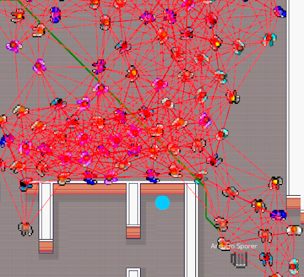
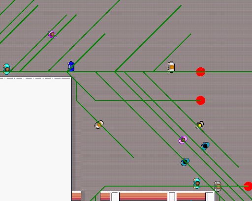
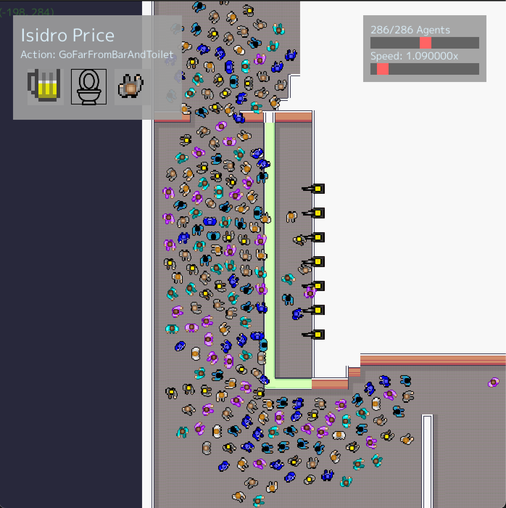

<h1 style="text-align: center">
    
    Pic à GOGO
    
</h1>

Pic à GOGO is a multi-agent simulation of a bar. The goal of the simulation is to study the crowd movements in a bar setting, were a few interest points concentrate the crowd. The simulation is written in Go and uses the [Ebiten](https://ebiten.org/) game engine. 

<div style="display: flex;">
    
    
</div>


## Project Setup

This project is written in Go. Ituses the [Go module system](https://blog.golang.org/using-go-modules) to manage
dependencies. As the simulation needs a handful of external assets in addition to the executable to work properly, we
recommend to use the `go run` command inside the cloned repository instead of using `go install`.

### Installation

1. Clone the repository:

```bash
git clone https://gitlab.utc.fr/royhucheradorni/ia04.git
```

## Running the Program

Start the Simulation:

```bash
go run gitlab.utc.fr/royhucheradorni/ia04.git/cmd/simulation
```

If you are using WSL, you may need to use the following command instead:

```bash
GOOS=windows go run gitlab.utc.fr/royhucheradorni/ia04.git/cmd/simulation
```

There is also a WebAssembly version of the simulation. Simply open the [index.html](index.html) file in your browser to start the simulation.
A pre-compiled version is included in the repository, but you can compile it yourself using the following command:

```bash
GOARCH=wasm GOOS=js go build -o main.wasm gitlab.utc.fr/royhucheradorni/ia04.git/cmd/simulation
```
